# Clank w/ Mudstick Extruder

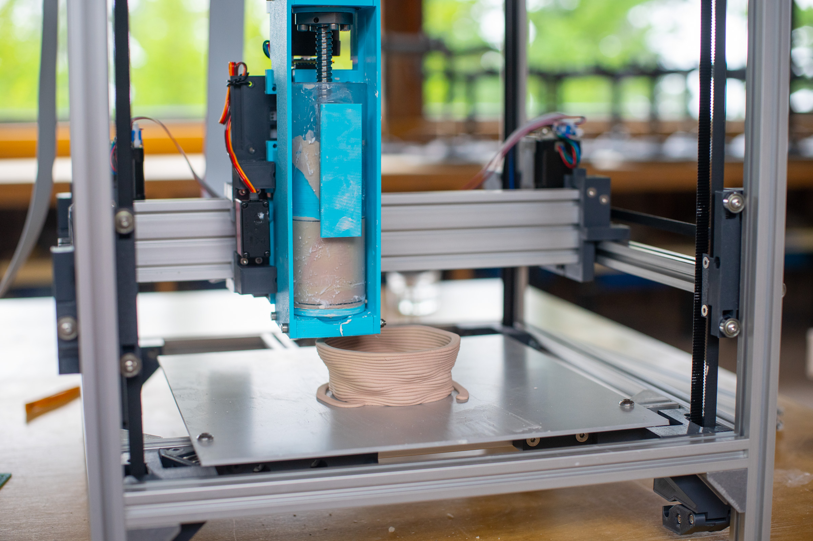

The [clank](https://fab.cba.mit.edu/classes/865.21/people/jakeread/fxy/) project is an ongoing effort at the MIT Center for Bits and Atoms to produce a small scale modular machine platform to make "almost anything" using a wide variety of tools (end effectors) on a common motion platform.

You've found the documentation for an instance of this project that lives at the [Haystack Mountain School of Crafts](https://www.haystack-mtn.org/) in the ceramics studio, and uses a plunger / extruder to produce ceramic artefacts. 

This repository contains:

- a brief guide on how to operate the machine 
- the codes and configurations required to interface with the machine 
- the computer aided design files for the machine and extruder 

For assistance or to troubleshooting, please read the repository thoroughly first. If your issue persists, please start an issue here - I will try to respond to your queries. 

## Preparing Files for Clank-MS

The machine basically thinks it's a normal 3D Printer, so I use [prusa slicer](https://www.prusa3d.com/prusaslicer/) (based on the OG [slic3r](https://slic3r.org/)) to prepare files. Without getting into the details, I've prepared a configuration for this machine that you can download from [this repo](slicer). The setup is also pre-configured on the Haystack computer that runs this machine. 

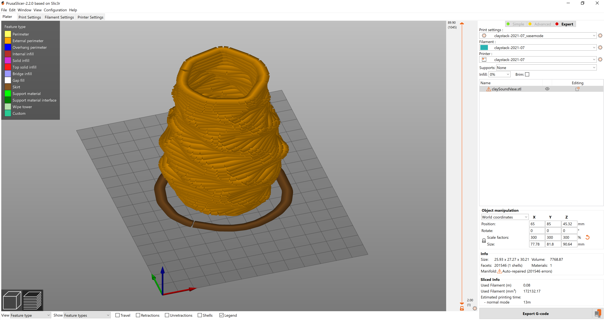 

The key points are:

- turn on `expert mode` in the top right 
- use 'vase mode' in `print settings >> layers and perimeters >> vertical shells`
- do `print settings >> layer height`` to change the height of a coil 
- do `printer settings >> extruder 1 >> nozzle diameter` if changing nozzle diameter 
- do `filament settings >> filament >> extrusion multiplier` to arbitrarily squish more or less clay from the machine 
- do `print settings >> advanced >> resolution` to about 0.5mm for more easily interpreted g-codes for the machine 

## Operating Clank-MS 

To launch the machine software, open the `git bash` program installed during setup - there is a netbook at haystack with this setup already complete. 

In `git bash` navigate to the `controller` folder in this repository and run the command:

`node clank` 

This will launch a process that can communicate with the machine via a web browser. It will report that `clank-tool is available on: 127.0.0.1:8080` - the numbers here are an address that you can type into a browser window: loading this window will launch the machine interface. It looks like this:

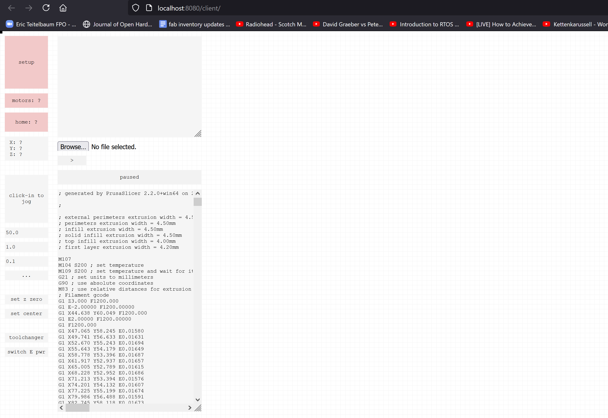

The machine should be plugged in to the computer's USB port, and the power can be turned on. First, hit the `setup` button and wait for the machine to wake up. If it turns red, try simply refreshing the page and clicking it again. If an issue persists, shut the power off, unplug and re-plug the usb connection, and try again. 

Once the `setup` routine is green, you can hit the 'home' button - this will lift the extruder to a reference at the top of the machine and then reference X and Y directions. Now the machine is ready to use. 

### Loading Clay

The machine uses a piston / plunger type extruder. Clay bodies can be loaded into interchangeable pistons before printing - or even changed out mid-print (by pausing the machine). 

During my time at haystack, we used a porcelain body straight out of the bag, and added some mason stain for colour. The body was loose enough without any extra prep to extrude, but a more rigid stoneware may need to have some moisture wedged in. 

Getting clay into the tube is as straightforward as you want it to be: roll up a log and squish it in, trying to avoid air bubbles when possible.

To get the piston into the machine, the ball screw (shiny metal thing sticking out of the plunger) can be turned by hand - either via the pulley or directly. The extruder motor can be turned on and off separately from other motors with the `switch E pwr` button on the lower left of the interface. Lift the ballscrew to its top position and shimmy the piston in, then screw the ballscrew down by hand until some clay comes out of the nozzle and turn the E motor power back on. 

### The Print Surface

You can print onto anything. There are two aluminum beds that locate in the machine with a "kinematic mount" that can be used, or a simple batt or plywood plate can be placed in the machine's floor. We have also thrown bases and printed walls onto them, to mix practice. Mess around and find out. 

### Finding Z Zero

Once the machine is setup and homed, and clay is in the tube, you can set the reference plane for the job. To do this, the interface has a jogging feature. Click the big button that says `click in to jog` and your arrow keys will bump the machine around. To make bigger steps, hold down `x` and to move the z-axis, hold down `z` on your keyboard. Try to avoid squishing the z-axis into the bed. 

Manouver the machine such that the nozzle is just about touching the build surface, and hit the `set z zero` button. To reference a center point, hit the `set center` button. 

### Running the Job 

Now you can run the job: hit `browse` and load a gcode file prepared above. Click the `>` play button to run the gcode! 

### Operating Notes

- don't home the machine without first manually moving the extruder to the center of travel. the tall plunger will contact some of the Z motors if not
- please ensure the USB is plugged in when powering the main supply on! 
- the plunger can run out of clay and bottom out without the machine knowing: this will put large mechanical loads on the extruder belt - and is best avoided (but not catastrophic) 

## Previous Results 

Our first test piece:

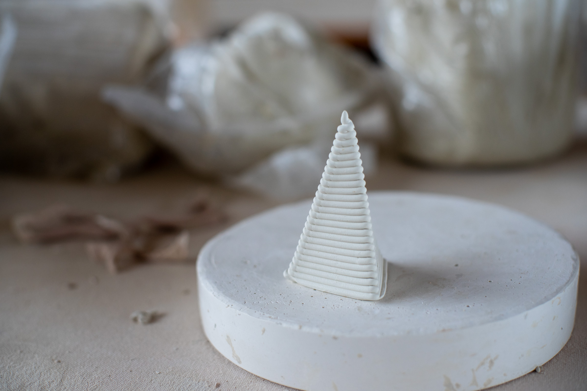

These were designed by extracting a waveform from an audio recording of a gong hit, wrapped around a cylinder in Rhino / Grasshopper, w/ Amira Abdel-Rahman and Matt Crane:

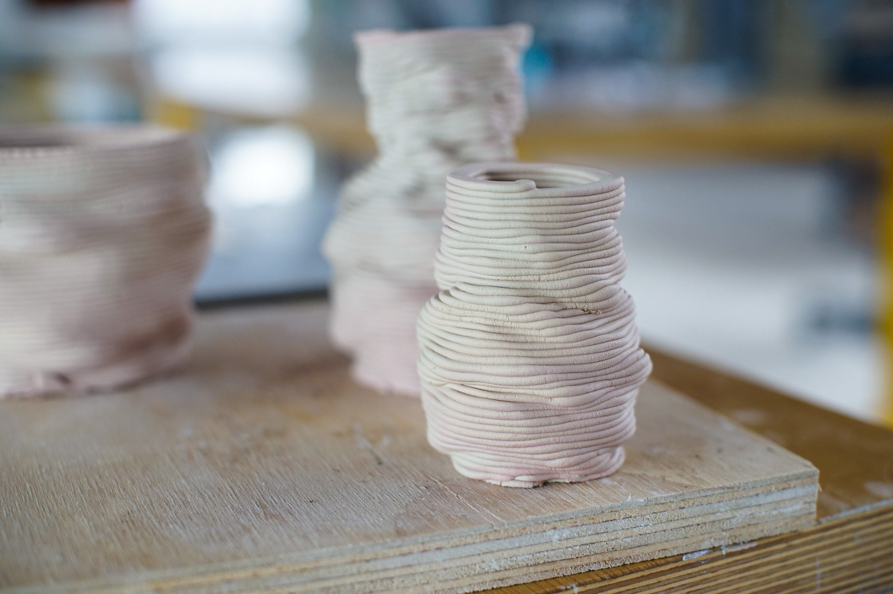
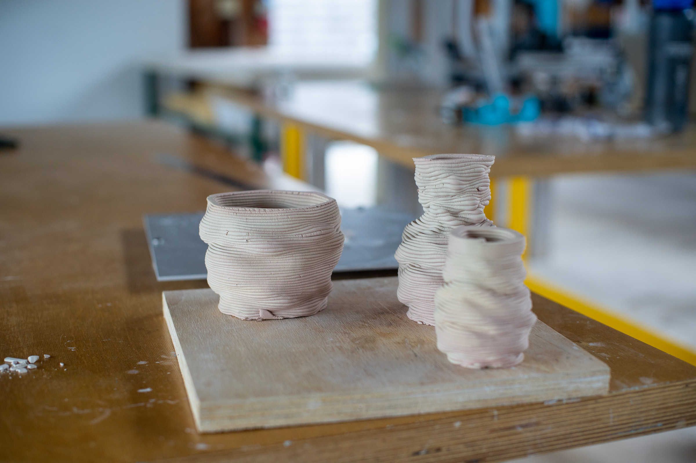

For this piece, and those below, we used a porcelain clay body with three mason stains added, each color extruded alongside one another a-la "aquafresh" toothpaste. The layering can be trimmed back... here, patterns were added by hand:

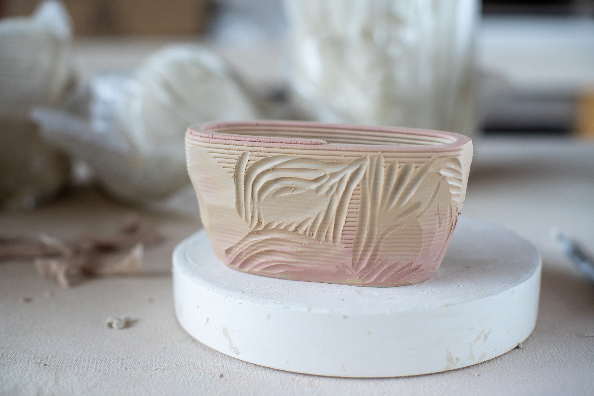
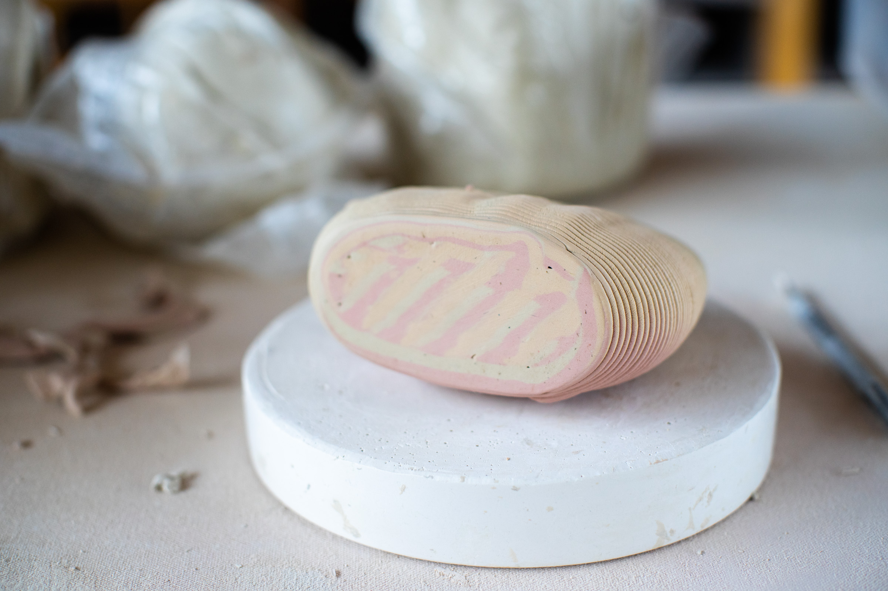
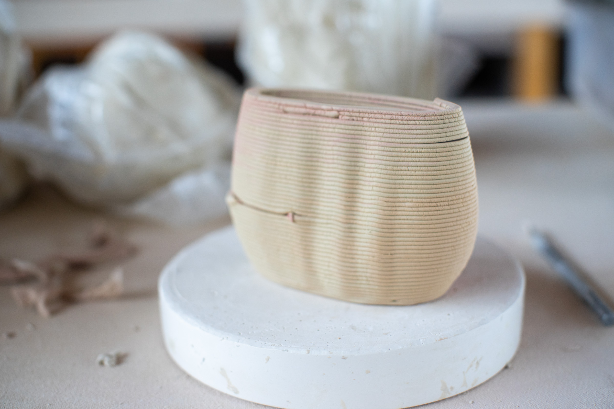

This mug was in collaboration with Amanda Soule `@thedeercat` - she threw the base on a plaster bat w/ engraved and slip-painted detail, the machine extruded the mug walls. It was trimmed by hand and the exterior walls were painted in with a fourth color of slip. 

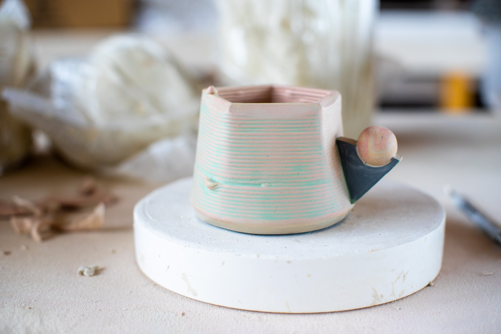
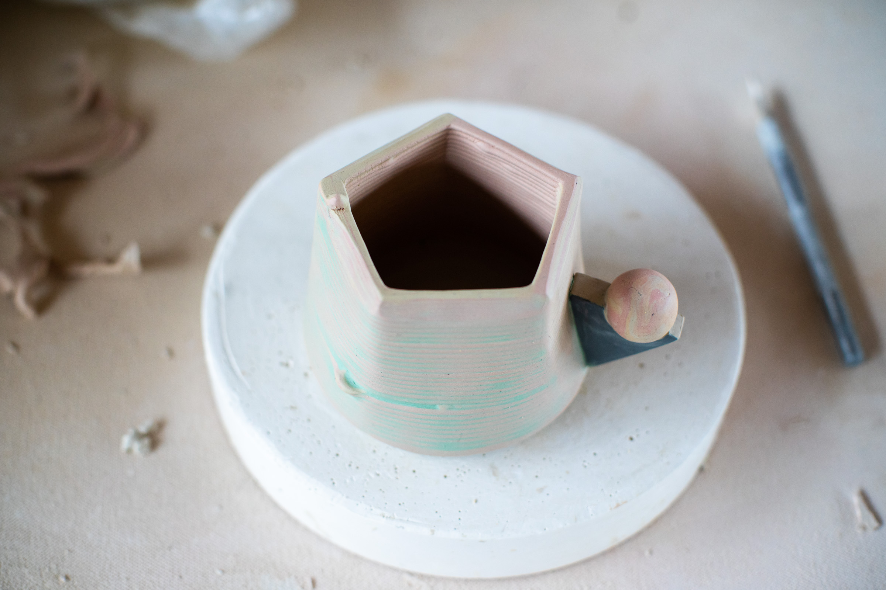
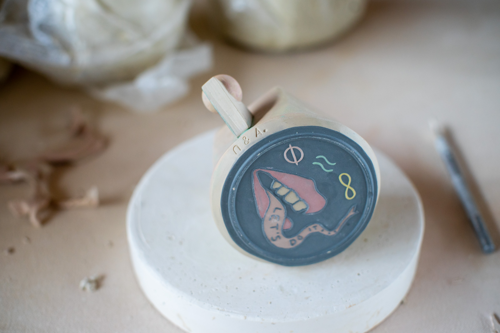
